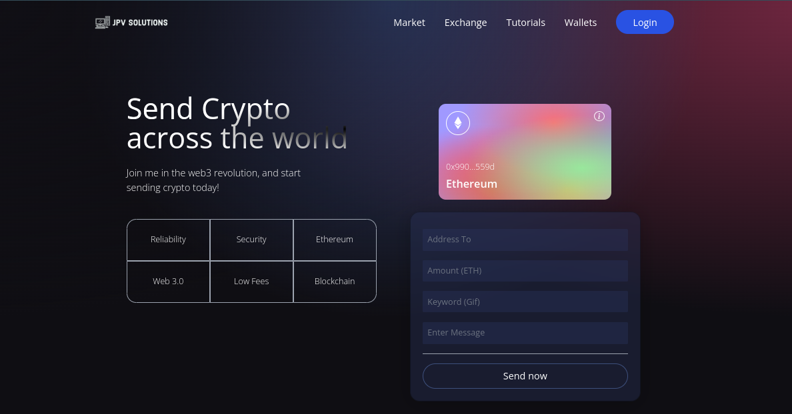
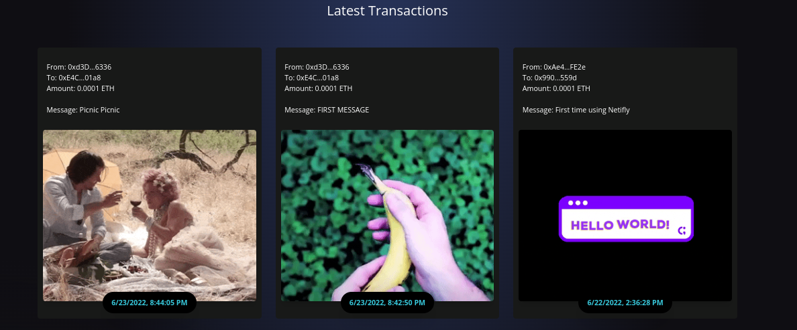

<!--
*** Thanks for checking out the Best-README-Template. If you have a suggestion
*** that would make this better, please fork the repo and create a pull request
*** or simply open an issue with the tag "enhancement".
*** Don't forget to give the project a star!
*** Thanks again! Now go create something AMAZING! :D
-->

<!-- PROJECT LOGO -->
 

  

  <h3 align="center">DApp with Solidity and React</h3>

  

    First version of DApp, with ability to login via metamask, send ETH with custom message, Giphy API based on user keywords, and all transactions recorded at the bottom
     
  

  

<!-- ABOUT THE PROJECT -->
## About The Project

- Used Solidity Smart Contract for DApp transactions on ETH. Once user logged into metamask they can view all transactions made on website. 
- Utilized GIPHY-API for sending a gif with each transaction based on keyword/s provided by user. Transaction processed included amount of ETH, personal message, timestamp, and custom gif from API.

Next Features Include

1- Exploring Seven Layer Trust Protocol - Security is at the forefront in terms of application success, and I want to provide that.
2- Real Time Analysis of Crypto Market - Using data Analytics tools, API's, etc. I will have real time stock analysis of the crypto market.
3- Expand Navigation - Navigation is currently disable as sole focus was first to send ETH transactions with GIPHY-API.

(<a href="#top">back to top</a>)

### Built With

Built with the following:

* [React](https://reactjs.org/)
* [Solidity](https://docs.soliditylang.org/en/v0.8.15/)
* [Node.js](https://nodejs.org/en/)
* [Giphy](https://giphy.com/)

(<a href="#top">back to top</a>)

### Conclusion

With job hunt still in process I will have to put this project on hold until I secure a position. If interested don't hesitate to contact me for more information!

(<a href="#top">back to top</a>)

